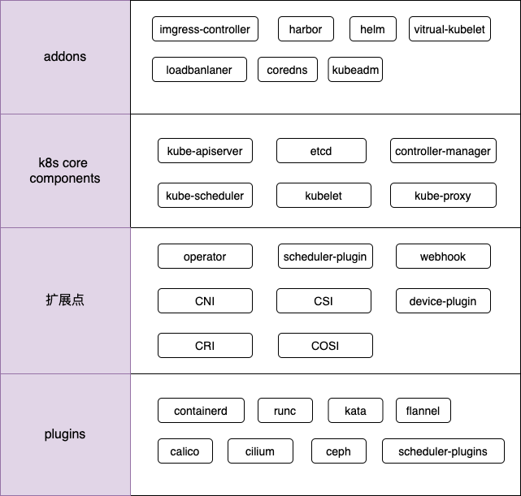

# k8s/云原生 技术总结
## 内容说明
* 云原生是一个很大的话题，本文主要围绕着 kubernetes 为核心，以及可扩展的插件，进行知识总结，主要包含内容如下图所示
* 对于涉及到的组件，会进行工作原理、机制的剖析

# kubernetes
- [`从0到1开发一个 operator`](kubernetes/从0到1开发一个operator.md)
- [`使用 kubebuilder 开发 operator`](kubernetes/使用kubebuilder开发一个operator.md)
- kube-scheduler 启动过程
- kubelet 启动过程