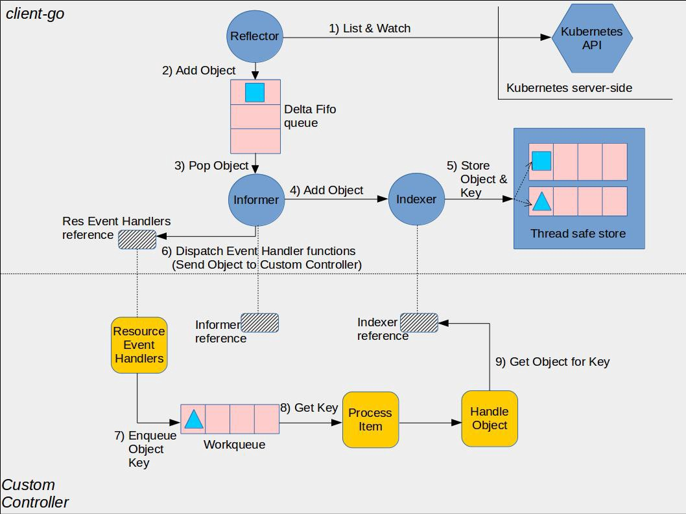

# 什么是 operator ？

operator 是一种 kubernetes 的扩展形式，利用自定义资源对象（Custom Resource）来管理应用和组件，允许用户以 Kubernetes 的声明式 API 风格来管理应用及服务。

> Operator = CRD + Controller + Webhook

## **常见的 operator 工作模式**


工作流程：

1. 用户创建一个自定义资源 (CRD)；

2. apiserver 根据自己注册的一个 pass 列表，把该 CRD 的请求转发给 webhook；

3. webhook 一般会完成该 CRD 的缺省值设定和参数检验。webhook 处理完之后，相应的 CR 会被写入数据库，返回给用户；

4. 与此同时，controller 会在后台监测该自定义资源，按照业务逻辑，处理与该自定义资源相关联的特殊操作；

5. 上述处理一般会引起集群内的状态变化，controller 会监测这些关联的变化，把这些变化记录到 CRD 的状态中。


目前，构架 Operator 框架主要有两个工具 Kubebuilder 和 operator SDK，**本文主要讲述如何不使用脚手架，从零到1开发一个自己的 Operator 应用**。

先放一张 controller与informer交互的经典图



# code-generator

`k8s.io/client-go` 提供了对 k8s 原生资源的 informer 和 clientset 等等，但对于自定义资源的操作则相对低效，需要使用 rest api 和 dynamic client 来操作，并自己实现反序列化等功能。

code-generator 提供了以下工具用于为 k8s 中的资源生成相关代码，可以更加方便的操作自定义资源：

* `deepcopy-gen`: 生成深度拷贝对象方法

  使用方法：

    * 在文件中`pkg/apis/<apigroup>/<version>/doc.go`添加注释 `// +k8s:deepcopy-gen=package`，默认为该包中的每个类型创建deepcopy方法。
    * 为单个类型添加自动生成`// +k8s:deepcopy-gen=true`
    * 为单个类型关闭自动生成`// +k8s:deepcopy-gen=false`

* `client-gen`: 为资源生成标准的操作方法(get;list;watch;create;update;patch;delete)

  使用方法（在`pkg/apis/<apigroup>/<version>/types.go`中使用）：

    * `// +genclient` - 生成默认的客户端动作函数（create, update, delete, get, list, update, patch, watch以及 是否生成updateStatus取决于.Status字段是否存在）
    * `// +genclient:nonNamespaced` - 所有动作函数都是在没有名称空间的情况下生成
    * `// +genclient:onlyVerbs=create,get` - 指定的动作函数被生成.
    * `// +genclient:skipVerbs=watch` - 生成 watch 以外所有的动作函数.
    * `// +genclient:noStatus` - 即使`.Status`字段存在也不生成 updateStatus 动作函数

* `informer-gen`: 生成 informer，提供事件机制 (AddFunc,UpdateFunc,DeleteFunc) 来响应 kubernetes 的 event

* `lister-gen`: 为get和list方法提供只读缓存层

* `conversion-gen`: 是用于自动生成在内部和外部类型之间转换的函数的工具

  一般的转换代码生成任务涉及三套程序包：

    - 一套包含内部类型的程序包，
    - 一套包含外部类型的程序包
    - 单个目标程序包（即，生成的转换函数所在的位置，以及开发人员授权的转换功能所在的位置）。包含内部类型的包在Kubernetes的常规代码生成框架中扮演着称为`peer package`的角色。

  使用方法：

    - 标记转换内部软件包 `// +k8s:conversion-gen=<import-path-of-internal-package>`
    - 标记转换外部软件包`// +k8s:conversion-gen-external-types=<import-path-of-external-package>`
    - 标记不转换对应注释或结构 `// +k8s:conversion-gen=false`

- `defaulter-gen` 用于生产 Defaulter 函数

    - 为包含字段的所有类型创建 defaulters，`// +k8s:defaulter-gen=<field-name-to-flag>`
    - 所有都生成`// +k8s:defaulter-gen=true|false`

- `go-to-protobuf` 通过go struct生成pb idl

- `import-boss` 在给定存储库中强制执行导入限制

- `openapi-gen` 生成openAPI定义

  使用方法：

    - `+k8s:openapi-gen=true` 为指定包或方法开启
    - `+k8s:openapi-gen=false` 指定包关闭

- `register-gen` 生成register

- `set-gen`

code-generator 整合了这些 gen，使用脚本 `generate-groups.sh` 和 `generate-internal-groups.sh` 可以为自定义资源生产相关代码。


# 项目设计

有了使用 code-generator 的基础，接下来，我们开始一起开发一个简单的 operator 应用，用来控制 deployment 的 replicas 的数量。

```
apiVersion: extension.k8s.io/v1
kind: UnitedDeployment
metadata:
  name: example-united-deployment
spec:
  deploymentName: example-deployment
  replicas: 2
```

# 初始化项目

## 创建一个项目（crd-controller）

```
[root@localhost crd-controller]# tree
.
|-- Dockerfile
|-- README.md
|-- go.mod
|-- go.sum
|-- main.go
`-- pkg
    |-- apis
    |   `-- extension
    |       |-- register.go
    |       `-- v1
    |           |-- doc.go
    |           |-- register.go
    |           `-- types.go
    `-- generated
```

在 pkg/apis/extension/v1目录创建 doc.go、register.go、types.go。首先，先在 types.go 文件定义我们要创建的 crd 字段。

```golang
package v1

import (
	metav1 "k8s.io/apimachinery/pkg/apis/meta/v1"
)

// UnitedDeployment is a specification for a UnitedDeployment resource
type UnitedDeployment struct {
	metav1.TypeMeta   `json:",inline"`
	metav1.ObjectMeta `json:"objectMeta,omitempty"`
	Spec              UnitedDeploymentSpec   `json:"spec"`
	Status            UnitedDeploymentStatus `json:"status"`
}

// UnitedDeploymentSpec is the spec for a UnitedDeployment resource
type UnitedDeploymentSpec struct {
	DeploymentName string `json:"deploymentName"`
	Replicas       *int32 `json:"replicas"`
}

// UnitedDeploymentStatus is the status for a UnitedDeployment resource
type UnitedDeploymentStatus struct {
	AvailableReplicas *int32 `json:"availableReplicas"`
}

// UnitedDeploymentList is a list of UnitedDeployment resources
type UnitedDeploymentList struct {
	metav1.TypeMeta `json:",inline"`
	metav1.ListMeta `json:"metadata,omitempty"`
	Items           []UnitedDeployment `json:"items"`
}
```

然后，在 register.go 文件中，增加以下代码，向全局 Scheme 注册自定义类型`UnitedDeployment`和`UnitedDeploymentList`

```golang
package v1

import (
	metav1 "k8s.io/apimachinery/pkg/apis/meta/v1"
	"k8s.io/apimachinery/pkg/runtime"
	"k8s.io/apimachinery/pkg/runtime/schema"

	"crd-controller/pkg/apis/extension"
)

// SchemeGroupVersion is group version used to register these objects
var SchemeGroupVersion = schema.GroupVersion{Group: extension.GroupName, Version: "v1"}

// Kind takes an unqualified kind and returns back a Group qualified GroupKind
func Kind(kind string) schema.GroupKind {
	return SchemeGroupVersion.WithKind(kind).GroupKind()
}

// Resource takes an unqualified resource and returns a Group qualified GroupResource
func Resource(resource string) schema.GroupResource {
	return SchemeGroupVersion.WithResource(resource).GroupResource()
}

var (
	// SchemeBuilder initializes a scheme builder
	SchemeBuilder = runtime.NewSchemeBuilder(addKnownTypes)
	// AddToScheme is a global function that registers this API group & version to a scheme
	AddToScheme = SchemeBuilder.AddToScheme
)

// Adds the list of known types to Scheme.
func addKnownTypes(scheme *runtime.Scheme) error {
	scheme.AddKnownTypes(SchemeGroupVersion,
		&UnitedDeployment{},
		&UnitedDeploymentList{},
	)
	metav1.AddToGroupVersion(scheme, SchemeGroupVersion)
	return nil
}
```

doc.go 文件，后续code-generator标识全局标记使用，目前为空。

pkg/apis/extension/register.go 中，GroupName表示group组的名称

```golang
package extension

// GroupName is the group name used in this package
const (
	GroupName = "extension.k8s.io"
)
```

## 使用 code-generator

创建好项目后，接下来就需要使用 code-generator 为自定义的 crd 资源，生成 deepcopy、clientSet、informer、lister 代码。

### 更新依赖版本

k8s.io/apimachinery库、k8s.io/client-go库、code-generator版本需要保持一致。

需要将初始化的k8s库更新到要使用的版本，如：

```shell
[root@localhost crd-controller# K8S_VERSION=v0.28.0
[root@localhost crd-controller]# go get k8s.io/client-go@$K8S_VERSION
[root@localhost crd-controller]# go get k8s.io/apimachinery@$K8S_VERSION
```

更新后的 go.mod

```shell
[root@localhost crd-controller]# cat go.mod
module crd-controller

go 1.19

require (
	k8s.io/apimachinery v0.28.0
	k8s.io/client-go v0.28.0
	k8s.io/klog/v2 v2.100.1
)
```

### 安装 code-generator

拷贝 [sample-controller](https://github.com/kubernetes/sample-controller) 项目 ./hack 目录下的文件到项目目录下

```text
[root@localhost crd-controller]# tree
.
|-- Dockerfile
|-- README.md
|-- go.mod
|-- go.sum
|-- hack
|   |-- boilerplate.go.txt
|   |-- custom-boilerplate.go.txt
|   |-- tools.go
|   |-- update-codegen.sh
|   `-- verify-codegen.sh
|-- main.go
`-- pkg
    |-- apis
    |   `-- extension
    |       |-- register.go
    |       `-- v1
    |           |-- doc.go
    |           |-- register.go
    |           `-- types.go
    `-- generated
```

k8s的版本号与 `go.mod` 中的 `k8s.io/client-go` 的版本保持一致即可。

```
[root@localhost crd-controller]# go get k8s.io/code-generator@$K8S_VERSION
[root@localhost crd-controller]# go mod vendor
```

### 增加 code-generator tag

在 pkg/apis/extension/v1/doc.go文件增加 global tag，`+k8s:deepcopy-gen=package`：这个注释告诉 Kubernetes 的代码生成工具 `deepcopy-gen`为这个package下的所有types类型生成deepcopy代码，`+groupName=extension.k8s.io`：这个注释定义了 Kubernetes 扩展 API 的组名（group name)。

```golang
// +k8s:deepcopy-gen=package
// +groupName=extension.k8s.io

// Package v1 is the v1 version of the API.
package v1
```

在 pkg/apis/extension/v1/types.go 文件分别为`UnitedDeployment`和`UnitedDeploymentList`增加 tag，`+genclient`：这个注释告诉 Kubernetes 代码生成工具生成客户端代码，`+k8s:deepcopy-gen:interfaces=k8s.io/apimachinery/pkg/runtime.Object`：这个注释告诉 Kubernetes 的代码生成工具生成深拷贝（deep copy）相关的代码，以便确保在操作自定义资源对象时不会影响原始对象。`k8s.io/apimachinery/pkg/runtime.Object` 是 Kubernetes 中用于对象深拷贝的接口。通过这个注释，你告诉生成工具为你的自定义资源对象生成与深拷贝相关的代码。

```golang
// +genclient
// +k8s:deepcopy-gen:interfaces=k8s.io/apimachinery/pkg/runtime.Object

// UnitedDeployment is a specification for a UnitedDeployment resource
type UnitedDeployment struct {
	metav1.TypeMeta   `json:",inline"`
	metav1.ObjectMeta `json:"objectMeta,omitempty"`
	Spec              UnitedDeploymentSpec   `json:"spec"`
	Status            UnitedDeploymentStatus `json:"status"`
}
...

// +k8s:deepcopy-gen:interfaces=k8s.io/apimachinery/pkg/runtime.Object

// UnitedDeploymentList is a list of UnitedDeployment resources
type UnitedDeploymentList struct {
	metav1.TypeMeta `json:",inline"`
	metav1.ListMeta `json:"metadata,omitempty"`
	Items           []UnitedDeployment `json:"items"`
}
```

### 执行 update-codegen.sh

完成以上步骤，就可以执行 `./hack/update-codegen.sh`生成相关代码

```text
[root@localhost crd-controller]# tree
.
|-- Dockerfile
|-- README.md
|-- go.mod
|-- go.sum
|-- hack
|   |-- boilerplate.go.txt
|   |-- custom-boilerplate.go.txt
|   |-- tools.go
|   |-- update-codegen.sh
|   `-- verify-codegen.sh
|-- main.go
`-- pkg
    |-- apis
    |   `-- extension
    |       |-- register.go
    |       `-- v1
    |           |-- doc.go
    |           |-- register.go
    |           |-- types.go
    |           `-- zz_generated.deepcopy.go
    `-- generated
        |-- clientset
        |   `-- versioned
        |       |-- clientset.go
        |       |-- fake
        |       |   |-- clientset_generated.go
        |       |   |-- doc.go
        |       |   `-- register.go
        |       |-- scheme
        |       |   |-- doc.go
        |       |   `-- register.go
        |       `-- typed
        |           `-- extension
        |               `-- v1
        |                   |-- doc.go
        |                   |-- extension_client.go
        |                   |-- fake
        |                   |   |-- doc.go
        |                   |   |-- fake_extension_client.go
        |                   |   `-- fake_uniteddeployment.go
        |                   |-- generated_expansion.go
        |                   `-- uniteddeployment.go
        |-- informers
        |   `-- externalversions
        |       |-- extension
        |       |   |-- interface.go
        |       |   `-- v1
        |       |       |-- interface.go
        |       |       `-- uniteddeployment.go
        |       |-- factory.go
        |       |-- generic.go
        |       `-- internalinterfaces
        |           `-- factory_interfaces.go
        `-- listers
            `-- extension
                `-- v1
                    |-- expansion_generated.go
                    `-- uniteddeployment.go
```

## 开发 controller

新建controller.go，增加custom_controller相关代码

定义 Controller 结构体

```golang
type Controller struct {
	// 获取原生kind资源kubeclient
	kubeclientset          kubernetes.Interface
	// 生成的crd客户端
	crdclientset           clientset.Interface
	// deployment的lister
	deploymentlister       appslisters.DeploymentLister
	// 判断deploymentInformer是否同步
	deploymentsynced       cache.InformerSynced
	// unitedDeployment的lister
	uniteddeploymentlister listers.UnitedDeploymentLister
	// 判断deploymentInformer是否同步
	uniteddeploymentsynced cache.InformerSynced
	// 限速队列
	workqueue              workqueue.RateLimitingInterface
	// recoder记录event事件
	recorder               record.EventRecorder
}
```

创建 controller 实例

```golang
func NewController(
	ctx context.Context,
	kubeClientset kubernetes.Interface,
	crdClientset clientset.Interface,
	deploymentInformer appsinformers.DeploymentInformer,
	unitedDeploymentInformer informers.UnitedDeploymentInformer,
) *Controller {
	logger := klog.FromContext(ctx)

	// 1. 向全局scheme注册crd资源
	utilruntime.Must(crdscheme.AddToScheme(scheme.Scheme))

	// 2. 创建recorder，记录event事件
	logger.V(4).Info("Creating event broadcaster")
	eventBroadcaster := record.NewBroadcaster()
	eventBroadcaster.StartStructuredLogging(0)
	eventBroadcaster.StartRecordingToSink(&typedcorev1.EventSinkImpl{Interface: kubeClientset.CoreV1().Events("")})
	recorder := eventBroadcaster.NewRecorder(scheme.Scheme, corev1.EventSource{Component: controllerAgentName})

	controller := &Controller{
		kubeclientset:          kubeClientset,
		crdclientset:           crdClientset,
		deploymentlister:       deploymentInformer.Lister(),
		deploymentsynced:       deploymentInformer.Informer().HasSynced,
		uniteddeploymentlister: unitedDeploymentInformer.Lister(),
		uniteddeploymentsynced: unitedDeploymentInformer.Informer().HasSynced,
		// 3.初始化workqueue
		workqueue: workqueue.NewNamedRateLimitingQueue(workqueue.DefaultControllerRateLimiter(), "unitedDeployment"),
		recorder:  recorder,
	}

	logger.Info("Setting up event handlers")

	// 4. 给unitedDeployment的 informer增加回调函数
	unitedDeploymentInformer.Informer().AddEventHandler(cache.ResourceEventHandlerFuncs{
		AddFunc: controller.enqueueUnitedDeployment,
		UpdateFunc: func(old, new interface{}) {
			controller.enqueueUnitedDeployment(new)
		},
	})

	// 5. 给deployment的 informer增加回调函数
	deploymentInformer.Informer().AddEventHandler(cache.ResourceEventHandlerFuncs{
		AddFunc: controller.handleObject,
		UpdateFunc: func(old, new interface{}) {
			newDepl := new.(*appsv1.Deployment)
			oldDepl := old.(*appsv1.Deployment)
			if newDepl.ResourceVersion == oldDepl.ResourceVersion {
				// Periodic resync will send update events for all known Deployments.
				// Two different versions of the same Deployment will always have different RVs.
				return
			}
			controller.handleObject(new)
		},
		DeleteFunc: controller.handleObject,
	})
	return controller
}
```

工作队列 workqueue 入队方法

```golang
func (c *Controller) enqueueUnitedDeployment(obj interface{}) {
	var key string
	var err error
	if key, err = cache.MetaNamespaceKeyFunc(obj); err != nil {
		utilruntime.HandleError(err)
		return
	}
	c.workqueue.Add(key)
}
```

对于deployment 触发的call back函数，进行逻辑判断，对于被unitedDeployment管理的deployment，进行入队操作，其他deployment忽略。

```golang
func (c *Controller) handleObject(obj interface{}) {
	var object metav1.Object
	var ok bool
	logger := klog.FromContext(context.Background())
	if object, ok = obj.(metav1.Object); !ok {
		tombstone, ok := obj.(cache.DeletedFinalStateUnknown)
		if !ok {
			utilruntime.HandleError(fmt.Errorf("error decoding object, invalid type"))
			return
		}
		object, ok = tombstone.Obj.(metav1.Object)
		if !ok {
			utilruntime.HandleError(fmt.Errorf("error decoding object tombstone, invalid type"))
			return
		}
		logger.V(4).Info("Recovered deleted object", "resourceName", object.GetName())
	}
	logger.V(4).Info("Processing object", "object", klog.KObj(object))
	if ownerRef := metav1.GetControllerOf(object); ownerRef != nil {
		// If this object is not owned by a Foo, we should not do anything more
		// with it.
		if ownerRef.Kind != "UnitedDeployment" {
			return
		}

		ud, err := c.uniteddeploymentlister.UnitedDeployments(object.GetNamespace()).Get(ownerRef.Name)
		if err != nil {
			logger.V(4).Info("Ignore orphaned object", "object", klog.KObj(object), "foo", ownerRef.Name)
			return
		}

		c.enqueueUnitedDeployment(ud)
		return
	}
}
```

运行 controller

开始运行 controller，controller 作为 workqueue 的消费者，从 workqueue 取出object.key，然后进行协调操作，直到达到 spec状态 与集群中 status状态 一致。

```golang
func (c *Controller) Run(ctx context.Context, workers int) error {
	defer utilruntime.HandleCrash()
	defer c.workqueue.ShutDown()
	logger := klog.FromContext(ctx)

	logger.Info("Starting unitedDeployment controller")

	logger.Info("Waiting for informer caches to sync")

	if ok := cache.WaitForCacheSync(ctx.Done(), c.deploymentsynced, c.uniteddeploymentsynced); !ok {
		return fmt.Errorf("failed to wait for caches to sync")
	}

	logger.Info("Starting workers", "count", workers)

	for i := 0; i < workers; i++ {
		go wait.UntilWithContext(ctx, c.runWorker, time.Second)
	}
	logger.Info("Started workers")
	<-ctx.Done()
	logger.Info("Shutting down workers")
	return nil
}

func (c *Controller) runWorker(ctx context.Context) {
	for c.processNextWorkItem(ctx) {
	}
}

func (c *Controller) processNextWorkItem(ctx context.Context) bool {
	obj, shutdown := c.workqueue.Get()
	if shutdown {
		return false
	}

	err := func(obj interface{}) error {

		//TODO controller logic

		return nil
	}(obj)

	if err != nil {
		utilruntime.HandleError(err)
		return true
	}
	return true
}
```

## main函数

man函数作为项目入口，主要做以下几个内容：

1、创建 kubeclient 和 crdclient 客户端

2、创建 kubeInformerFactory、crdInformerFactory

3、创建controller实例

4、运行 kubeInformerFactory、crdInformerFactory

5、选主逻辑，高可用

6、运行controller

```golang
func main() {
	klog.InitFlags(nil)
	flag.Parse()

	ctx := signals.SetupSignalHandler()
	logger := klog.FromContext(ctx)

	// 若需要，开启 pprof
	if enablePprof {
		go func() {
			if err := http.ListenAndServe(pprofAddr, nil); err != nil {
				klog.Error(err, "unable to start pprof")
			}
		}()
	}

	cfg, err := buildConfig(kubeconfig)
	if err != nil {
		logger.Error(err, "Error building kubeconfig")
		klog.FlushAndExit(klog.ExitFlushTimeout, 1)
	}

	// 1、创建kubeClient、crdClient客户端
	kubeClient, err := kubernetes.NewForConfig(cfg)
	if err != nil {
		logger.Error(err, "Error building kubernetes clientset")
		klog.FlushAndExit(klog.ExitFlushTimeout, 1)
	}

	crdClient, err := clientset.NewForConfig(cfg)
	if err != nil {
		logger.Error(err, "Error building kubernetes clientset")
		klog.FlushAndExit(klog.ExitFlushTimeout, 1)
	}

	// 2、创建 kubeInformerFactory、crdInformerFactory
	kubeInformerFactory := kubeinformers.NewSharedInformerFactory(kubeClient, time.Second*30)
	crdInformerFactory := informers.NewSharedInformerFactory(crdClient, time.Second*30)

	// 3、创建 controller 实例
	controller := controller.NewController(ctx, kubeClient, crdClient,
		kubeInformerFactory.Apps().V1().Deployments(),
		crdInformerFactory.Extension().V1().UnitedDeployments())

	// 4、运行 kubeInformerFactory、crdInformerFactory
	kubeInformerFactory.Start(ctx.Done())
	crdInformerFactory.Start(ctx.Done())

	lock := &resourcelock.LeaseLock{
		LeaseMeta: metav1.ObjectMeta{
			Name:      leaseLockName,
			Namespace: leaseLockNamespace,
		},
		Client: kubeClient.CoordinationV1(),
		LockConfig: resourcelock.ResourceLockConfig{
			Identity: leaseLockId,
		},
	}

	// 5、进行选主逻辑
	leaderelection.RunOrDie(ctx, leaderelection.LeaderElectionConfig{
		Lock: lock,
		// IMPORTANT: you MUST ensure that any code you have that
		// is protected by the lease must terminate **before**
		// you call cancel. Otherwise, you could have a background
		// loop still running and another process could
		// get elected before your background loop finished, violating
		// the stated goal of the lease.
		ReleaseOnCancel: true,
		LeaseDuration:   60 * time.Second,
		RenewDeadline:   15 * time.Second,
		RetryPeriod:     5 * time.Second,
		Callbacks: leaderelection.LeaderCallbacks{
			OnStartedLeading: func(ctx context.Context) {

				// 6、选主成功，运行 controller 逻辑
				if err = controller.Run(ctx, 2); err != nil {
					logger.Error(err, "Error running controller")
					klog.FlushAndExit(klog.ExitFlushTimeout, 1)
				}
			},
			OnStoppedLeading: func() {
				// we can do cleanup here
				klog.Infof("leader lost: %s", leaseLockId)
				os.Exit(0)
			},
			OnNewLeader: func(identity string) {
				// we're notified when new leader elected
				if identity == leaseLockId {
					// I just got the lock
					return
				}
				klog.Infof("new leader elected: %s", identity)
			},
		},
	})
}
```

完整代码示例：https://github.com/lizhewei91/crd-controller

# 参考资料

sample-controller：https://github.com/kubernetes/sample-controller/tree/v0.28.0

code-generator：https://github.com/kubernetes/code-generator/tree/v0.28.0


